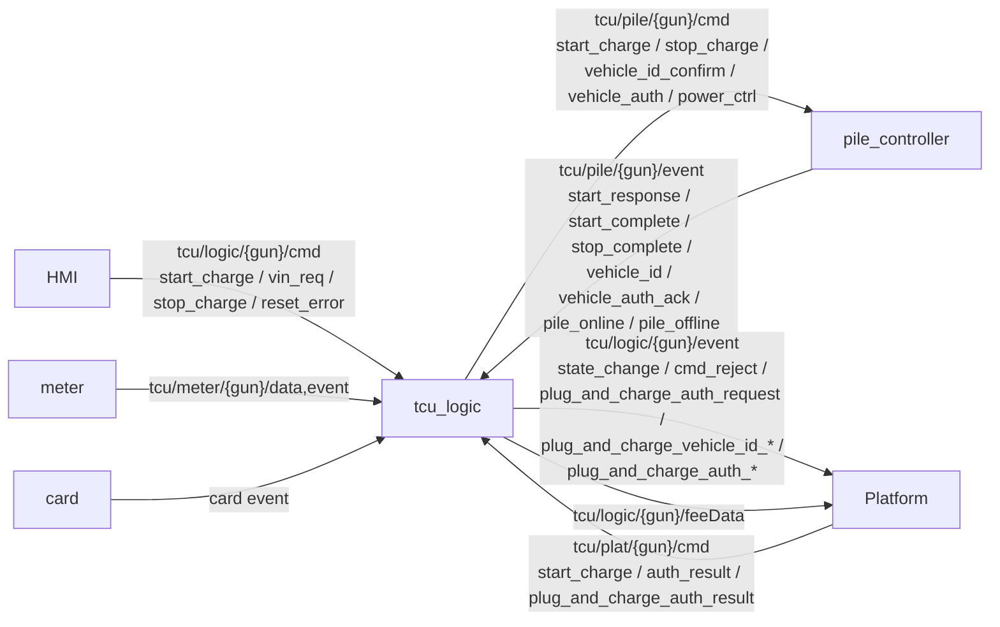
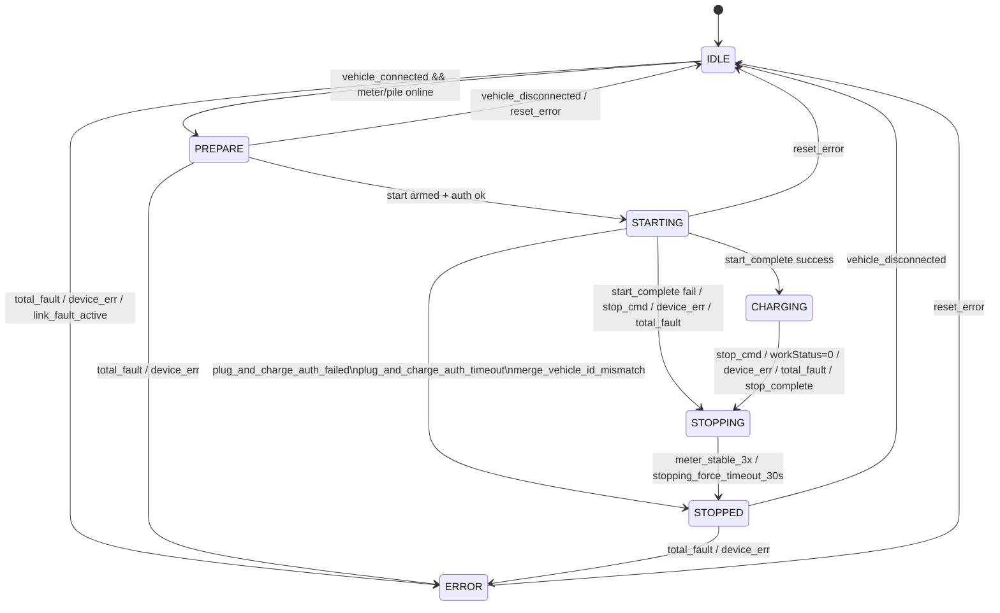
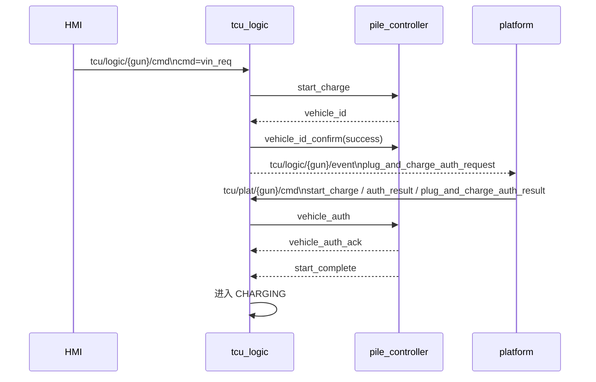
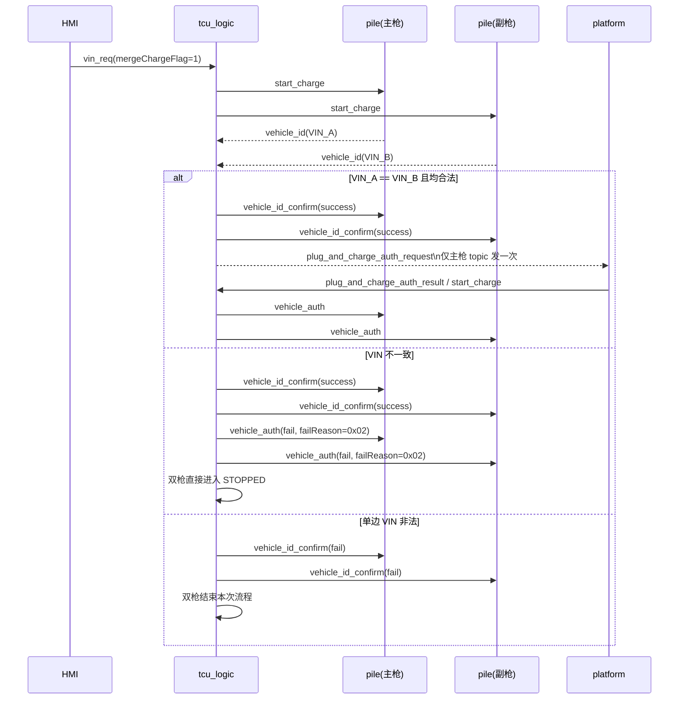

# tcu_logic 业务流程梳理（当前实现版）

## 1. 文档目的

本文档基于当前 `core/tcu_logic/charge_logic_process.cpp` 的实现，梳理 `tcu_logic` 的实际业务流程。

适用范围：
- 普通启动/停机流程
- 即插即充单枪流程
- 即插即充合并充双枪流程
- 当前超时、故障与收口方式

说明：
- 本文描述的是“当前代码已经实现的行为”，不是抽象目标设计。
- 如果文档与协议期望不一致，以当前代码行为为准。

配套 UML 文件：
- `core/tcu_logic/doc/LOGIC_CONTEXT_UML.puml`
- `core/tcu_logic/doc/LOGIC_NORMAL_START_FLOW_UML.puml`
- `core/tcu_logic/doc/LOGIC_PNC_SINGLE_UML.puml`
- `core/tcu_logic/doc/LOGIC_PNC_MERGE_UML.puml`

## 2. 模块职责

`tcu_logic` 当前承担 4 类职责：

1. 统一接入上游命令
- 接收 HMI 的 `tcu/logic/{gun}/cmd`
- 接收平台的 `tcu/plat/{gun}/cmd`
- 接收 pile 的 `tcu/pile/{gun}/event`
- 接收 meter 的 `tcu/meter/{gun}/data,event`

2. 维护每枪状态机
- `IDLE -> PREPARE -> STARTING -> CHARGING -> STOPPING -> STOPPED`
- 异常进入 `ERROR`

3. 组装启动上下文
- 启动方式
- VIN / 即插即充标志
- 订单与计费模型
- 停止原因、SOC、交易记录

4. 负责即插即充联动
- 处理 `0x17/0x18` 对应的 `vehicle_id / vehicle_id_confirm`
- 发布平台鉴权请求
- 根据平台结果下发 `vehicle_auth`
- 处理合并充双枪 VIN 一致性校验

## 3. MQTT 入口与出口

## 4. 每枪状态机

### 4.1 状态定义

- `IDLE`：空闲，等待插枪
- `PREPARE`：已插枪，等待启动
- `STARTING`：已向 pile 下发启动，等待启动完成
- `CHARGING`：充电中
- `STOPPING`：已进入停机流程，等待计量收敛
- `STOPPED`：本次充电已结束，等待拔枪回空闲
- `ERROR`：链路或设备故障态

### 4.2 状态机 UML

### 4.3 当前几个关键实现点

- `start_response` 当前不会驱动状态迁移，真正决定启动成败的是 `start_complete`
- `vehicle_auth_ack` 当前只会上报 `plug_and_charge_auth_ack` 事件，不会驱动状态机
- `STOPPING -> STOPPED` 的真正收口条件是电表稳定或 30s 强制收敛，不是 `stop_complete` 本身

## 5. 普通启动流程

### 5.1 HMI/平台普通启动

1. 车辆插枪，pile 遥信上送连接状态
2. `logic` 从 `IDLE` 进入 `PREPARE`
3. HMI 或平台下发 `start_charge`
4. `logic` 解析启动参数，写入 `GunState`
5. `logic` 缓存发给 pile 的 `start_charge.data`
6. 鉴权通过后，`logic -> pile` 下发 `start_charge`
7. 状态转为 `STARTING`
8. pile 返回 `start_complete`
9. 成功则进 `CHARGING`，失败则进入停机流程

### 5.2 停机流程

1. 收到 `stop_charge`、故障、金额触发停机、`workStatus=0` 等事件
2. `logic` 进入 `STOPPING`
3. 每 2s 重发一次 `stop_charge`
4. 电表连续 3 次稳定，或 `STOPPING` 超过 30s
5. `logic` 进入 `STOPPED`
6. 拔枪后回到 `IDLE`

## 6. 即插即充单枪流程

### 6.1 入口规则

HMI 发起即插即充时，当前支持：
- `cmd=vin_req`
- `cmd=start_charge`

只要 `plugAndChargeFlag == 2`，本次启动就会被视为即插即充启动。

### 6.2 时序图

### 6.3 处理逻辑

1. `logic` 收到 `vin_req`
- 进入启动准备
- 下发 pile `start_charge`

2. pile 上送 `vehicle_id`
- `logic` 校验 VIN 合法性
- 合法则下发 `vehicle_id_confirm(success)`
- 同时发布 `plug_and_charge_auth_request`

3. 平台回鉴权结果
- 成功：
  - 当前兼容 3 种入口：`start_charge`、`auth_result`、`plug_and_charge_auth_result`
  - `logic` 会统一转成 `vehicle_auth(success)` 下发给 pile
- 失败：
  - 下发 `vehicle_auth(fail)`
  - 直接进入 `STOPPED`

4. pile 后续进入常规启动完成流程
- `vehicle_auth_ack` 只做事件上报
- `start_complete` 成功后进入 `CHARGING`

## 7. 即插即充合并充双枪流程

### 7.1 当前双枪配对规则

当前 `logic` 使用“相邻枪按奇偶配对”：

- `0 <-> 1`
- `2 <-> 3`
- 依此类推

也就是说，合并充不是任意两枪组合，而是固定对枪模型。

### 7.2 入口条件

只有同时满足以下条件，才会进入双枪合并即插即充：

- `plugAndChargeFlag == 2`
- `mergeChargeFlag == 1`
- 当前枪处于 `PREPARE`
- 对枪存在
- 对枪也处于 `PREPARE`

否则发布 `cmd_reject`。

### 7.3 时序图

### 7.4 当前实现口径

#### 7.4.1 双枪同步启动

`logic` 不会先发一把枪、再发另一把枪。

当前做法是：

1. 两把枪先分别装载本次启动上下文
2. 两把枪都缓存好 `pendingStartData`
3. 再同步推进两把枪从 `PREPARE -> STARTING`
4. 同步向两个 pile 下发 `start_charge`

这样做的目的是避免一把枪已经启动、另一把枪还没进入同一次 VIN 流程。

#### 7.4.2 VIN 汇合判定

双枪合并充下：

- 第一把枪先上送 `vehicle_id` 时，不立刻向平台发鉴权请求
- `logic` 会先记录该枪 VIN，并发布 `plug_and_charge_vehicle_id_wait_peer`
- 等第二把枪也上送 `vehicle_id` 后，再做统一判断

判定结果分三类：

1. 单边 VIN 非法
- 双枪都结束
- 走非法 VIN 失败分支

2. 双边 VIN 都合法，但 VIN 不一致
- 不向平台发鉴权请求
- 两枪都回 `vehicle_id_confirm(success)`
- 随后两枪都下发 `vehicle_auth(fail, failReason=0x02)`
- 双枪直接进入 `STOPPED`
- 当前停止原因使用启动失败点 `0x36`

3. 双边 VIN 合法且一致
- 两枪都回 `vehicle_id_confirm(success)`
- 只由主枪发布一次 `plug_and_charge_auth_request`
- 副枪只同步标记“已进入等待平台鉴权结果”

#### 7.4.3 平台鉴权结果联动

平台返回即插即充结果后：

- 成功：`logic` 会把同一份 `vehicle_auth(success)` 同步下发到双枪
- 失败：`logic` 会把同一份 `vehicle_auth(fail)` 同步下发到双枪，并双枪直接进入 `STOPPED`

## 8. 超时与异常处理

### 8.1 普通启动/停机

- `STARTING` 30s：若未启动完成，重发一次 `start_charge`
- `STARTING` 60s：若仍未完成，进入停机流程
- `STOPPING` 每 2s：重发 `stop_charge`
- `STOPPING` 30s：强制收敛到 `STOPPED`
- 合并充余额自动停机：按双枪总金额判断是否达到总预充值金额；若平台分枪下发的 `prechargeAmount` 不一致，当前实现统一取两枪中的最小值

### 8.2 即插即充平台鉴权等待

- `plug_and_charge_auth_request` 发出后 30s 内未收到平台结果
- 单枪：下发 `vehicle_auth(fail, failReason=0x03)`，直接 `STOPPED`
- 双枪：仅主枪触发一次超时处理，但会同时向双枪下发失败 `vehicle_auth`，并双枪一起 `STOPPED`

### 8.3 电表/主控离线

- 电表离线：10s 确认窗口
- pile 离线：30s 确认窗口

处理原则：

- `IDLE/PREPARE`：进入 `ERROR`
- `STARTING/CHARGING`：走停机/异常收口
- `STOPPING`：不打断当前停机收敛

## 9. 当前实现与协议理解的边界

以下行为需要特别注意：

1. `start_response` 当前不决定状态迁移
- 当前代码收到 `start_response` 会转内部事件
- 但状态机没有基于它做迁移
- 真正决定是否进入 `CHARGING` 的仍是 `start_complete`

2. `vehicle_auth_ack` 当前不作为后续控制条件
- 只会上报 `plug_and_charge_auth_ack`
- 后续仍旧继续等待 `start_complete`

3. 合并充平台鉴权请求只发一次
- 当前只在主枪 topic 上发布一次 `plug_and_charge_auth_request`
- 副枪不单独再发一条请求

4. 双枪 VIN 不一致按“鉴权失败”处理
- 不是“非法 VIN”
- 当前口径是进入 VIN 流程后直接结束合并充

## 10. 建议的联调关注点

- 核对平台是否接受“合并充只发一次鉴权请求”的口径
- 核对 pile 是否接受“VIN 不一致时先回 `vehicle_id_confirm(success)`，再回 `vehicle_auth(fail)`”
- 核对双枪 `start_complete` 是否都能稳定上送，避免一枪进入 `CHARGING`、另一枪停在 `STARTING`
- 核对 `vehicle_auth_ack` 后是否还需要增加强约束超时
